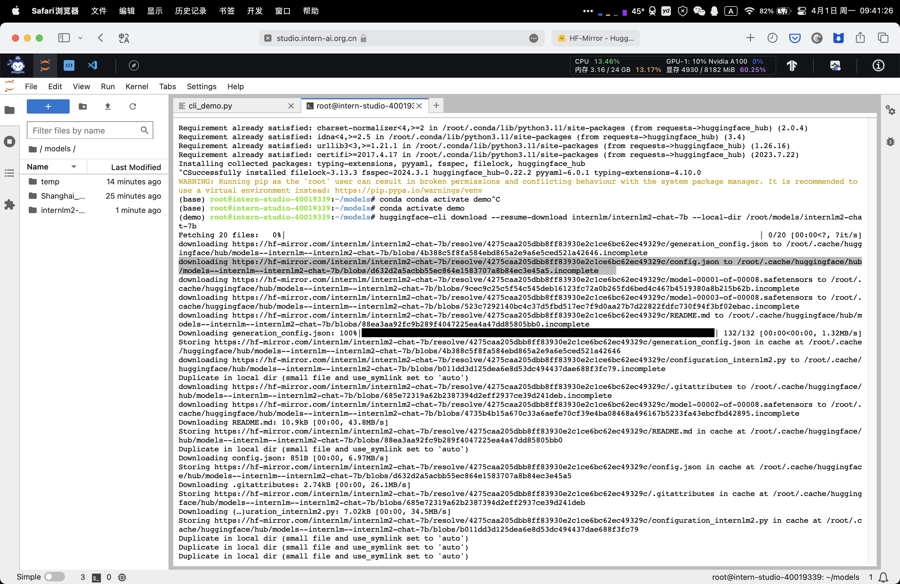

#### 一、基础作业 

使用 InternLM2-Chat-1.8B 模型生成 300 字的小故事（需截图）

#### 二、进阶作业 (优秀学员必做)

熟悉 huggingface 下载功能，使用 huggingface_hub python 包，下载 InternLM2-Chat-7B 的 config.json 文件到本地（需截图下载过程）

完成 浦语·灵笔2 的 图文创作 及 视觉问答 部署

这个地方资源比较难抢，目前没抢到资源弄！！！

完成 Lagent 工具调用 数据分析 Demo 部署

config.json 文件到本地（需截图下载过程）

